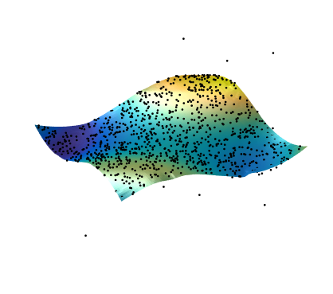

# loess_matlab
Robust locally weighted regression

This class implements the loess filter which performs a local robust weighted regression.
It works for multidimensional data-sets and can run in parallel. This implementation can be run natively on Matab and does not require compilation. It, however, is memory hungry and slower than the compiled version.
